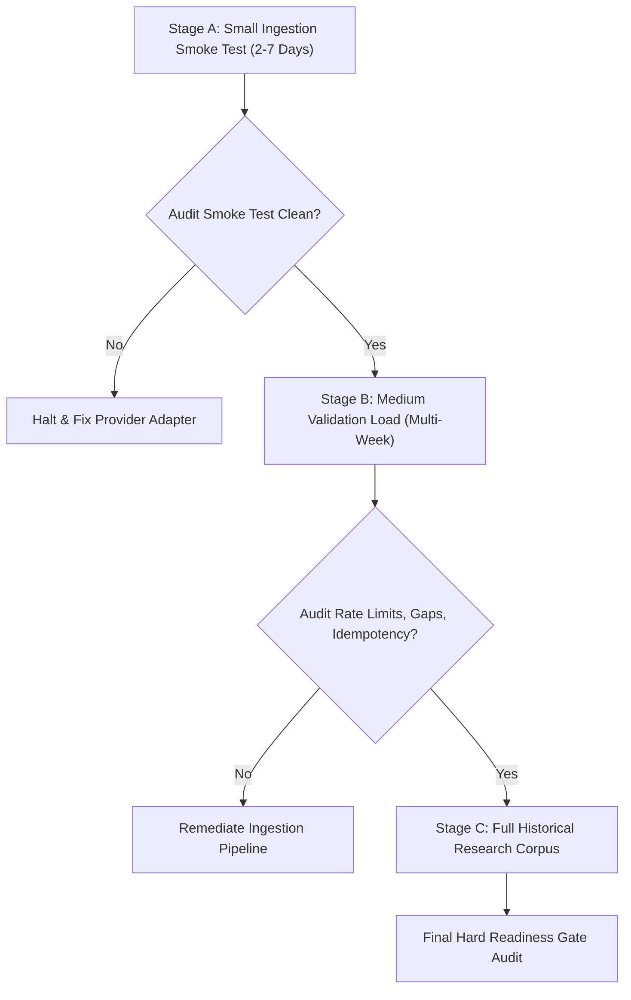

# AurumIQ — Primary XAUUSD Market Data Provider Specification & Requirements

> **Governance Authority:** Post Phase 7 / Pre Phase 8 Governance & Calibration Campaign  
> **Authoritative Target:** `XAUUSD` (Spot Gold denominated in USD)  
> **Listing Role:** `ListingRole.PRIMARY_XAUUSD_SPOT`  
> **Status:** Vendor Selection Pending Documentation — Real Historical Ingestion Path  
> **Primary Prohibitions:** Proxy Substitution (XAUT forbidden for XAUUSD), HTML Scraping forbidden, TradingView scraping forbidden.

---

## 1. Executive Purpose & Scope

This specification establishes the non-negotiable contract, architectural constraints, and validation protocols required for the authoritative primary market data provider for `XAUUSD` in the AurumIQ intelligence platform.

Under Sections 4, 5, and 6 of the Pre-Calibration Governance Directive:
1. **No Fake Schemas:** Until a specific institutional vendor or broker is selected and contractually bound with verified API documentation, no invented or synthetic vendor HTTP response formats may be deployed into production code.
2. **Normalized Contract Enforcement:** Any candidate provider adapter must map strictly into AurumIQ's immutable `RawCandle` and `MarketCandle` domain models without float-to-Decimal contamination.
3. **Fail-Closed Governance:** If the primary feed is unconfigured (`XAUUSD_PRIMARY_FEED_URL` absent), the system strictly reports `NOT_CONFIGURED` and fails closed. Substituting crypto-gold proxies (`XAUT/USDT`) for spot gold analytical series is prohibited under R1/Spec §0.

---

## 2. Environment Configuration Contract

All provider credentials, endpoints, and authentication keys must remain strictly decoupled from the codebase:

```bash
# Authoritative Primary Spot Gold Feed URL (Institutional ECN / Broker REST & WS)
XAUUSD_PRIMARY_FEED_URL=

# Authoritative Primary Spot Gold API / Authentication Token
XAUUSD_PRIMARY_API_KEY=

# Optional vendor-specific parameters genuinely required by the selected provider
XAUUSD_PRIMARY_ACCOUNT_ID=
XAUUSD_PRIMARY_FEED_TIMEOUT_SECONDS=10.0
```

### Security & Secret Governance:
- `.env` files are ignored in `.gitignore` and must never be committed.
- `.env.example` contains only placeholder parameter names.
- Passwords, API secrets, private keys, and broker credentials must never be committed or logged.

---

## 3. Normalized Ingestion Contract & Required Fields

Any primary provider adapter must deliver or normalize historical candlestick records into the following canonical schema:

| Field Name | Type / Format | Validation Constraint | Description |
| :--- | :--- | :--- | :--- |
| **`symbol`** | `str` | Exactly `XAUUSD` or canonical `XAU/USD` | Pure spot gold denominated in USD. Excludes XAUT, futures, or indices. |
| **`timeframe`** | `str` | One of `15m`, `1h`, `4h`, `1d`, `5m`, `1m` | Standard internal timeframe string. |
| **`timestamp_open`** | `datetime` (ISO-8601) | **Timezone-Aware (UTC)** | Exact start of the bar interval with non-None `tzinfo`. |
| **`timestamp_close`** | `datetime` (ISO-8601) | **Timezone-Aware (UTC)** | Exact end of the bar interval (`timestamp_close > timestamp_open`). |
| **`open`** | `Decimal` | `open > 0` | Authoritative opening price. No float parsing (`Decimal(str(val))`). |
| **`high`** | `Decimal` | `high >= max(open, close, low)` | Authoritative highest price within interval. |
| **`low`** | `Decimal` | `low <= min(open, close, high)` and `low > 0` | Authoritative lowest price within interval. |
| **`close`** | `Decimal` | `close > 0` | Authoritative closing / final price within interval. |
| **`volume`** | `Decimal` | `volume >= 0` | Volume metric delivered by provider. |
| **`volume_evidence`** | `VolumeEvidenceType` | `REAL_VOLUME`, `TICK_VOLUME`, `PROXY_VOLUME`, `UNAVAILABLE` | Explicit semantic classification of volume metric. |
| **`source`** | `str` | Canonical provider ID (e.g. `xauusd_primary`) | Explicit provenance tag bound to `MarketListing`. |
| **`is_closed`** | `bool` | `True` for historical backfill | Bar must be fully finalized; unclosed / forming bars rejected. |

### Contamination Rules:
- **No Float-to-Decimal Contamination:** Floating-point representations (e.g. `2045.15000000000009094947`) are forbidden. Raw JSON string or integer tick representations must be parsed directly into Python `Decimal`.
- **No HTML / Web Scraping:** Scraping web frontends (TradingView, investing.com, broker web portals) is strictly banned due to session fragility, legal non-compliance, and data revision silently corrupting timestamps.
- **Strict UTC Awareness:** Naive datetimes lacking timezone offsets fail validation and are rejected.

---

## 4. Volume Semantics & Classification

The primary provider must document the exact semantic nature of its volume field. AurumIQ classifies volume evidence into four deterministic categories:

1. **`REAL_VOLUME`:** Authoritative matched trading volume in physical ounces, lots, or currency value from an exchange or centralized clearinghouse.
2. **`TICK_VOLUME`:** Price update / quote frequency count per interval, common in OTC spot forex/metals ECNs. **Tick volume must never be misrepresented or stored as REAL_VOLUME.**
3. **`PROXY_VOLUME`:** Volume derived from an affiliated contract, ETF, or proxy venue.
4. **`UNAVAILABLE`:** Provider does not supply a defensible volume metric (defaults volume to 0 and flags feed policy to ignore volume components).

---

## 5. Historical Data Coverage & Timeframe Strategy

Calibration readiness cannot be satisfied by an arbitrary day count (such as demanding exactly 365 days) nor by a mere technical minimum (20 bars for feature warm-up). The historical corpus must satisfy statistical diversity:

### Required Analytical Timeframes:
- **`15m` (Authoritative Signal Frequency):** Core regime, trend alignment, pullbacks, and entry timing.
- **`1h`, `4h`, `1d` (Multi-Timeframe Context):** Macro trend, structural breaks (BOS), and higher-timeframe swings.

### Execution & Intrabar Replay Timeframes:
- **`1m`, `5m`:** Required for causal intrabar fill replay under Phase 5 execution policies (`LIMIT_ZONE`).

### Empirical Dataset Breadth Criteria:
- **Regime Diversity:** Historical data must span bull regimes, bear regimes, ranging/compression regimes, and high-volatility expansions.
- **Macro Event Diversity:** Historical data must capture high-impact point-in-time events (FOMC rate decisions, Non-Farm Payrolls, US CPI prints) to test blackout filters.
- **Walk-Forward Feasibility:** Corpus must be large enough to partition into at least 3-5 rolling train, validation, and untouched out-of-sample (OOS) folds with statistical significance.

---

## 6. Staged Backfill Protocol

To guarantee zero data contamination and deterministic idempotency, historical ingestion must proceed through three strictly sequenced stages:



### Stage A — Small Ingestion Smoke Test (2–7 Days):
- Request bounded window (e.g., 2–7 days of 15m, 1h, 4h, 1d, 5m, 1m).
- Validate HTTP response parsing, timestamp alignment, OHLC geometry, UTC offset, idempotency of `update_or_create`.
- Execute: `python manage.py audit_xauusd_readiness`.
- Verify zero duplicates, zero naive timestamps, zero OHLC violations.

### Stage B — Medium Validation Load (Multi-Week / Bounded Interval):
- Test pagination handling across deep historical requests.
- Verify provider rate-limit handling, backoff, and retry resilience.
- Verify weekend session gap detection (Friday 21:00 UTC to Sunday 22:00 UTC spot gold closure).
- Verify rerun idempotency without data duplication or row inflation.

### Stage C — Historical Research Corpus:
- Backfill approved comprehensive history across all required timeframes.
- Apply native provider bars where trustworthy; if higher timeframes are aggregated deterministically from lower timeframes, the aggregation methodology must be fully documented and audited.

---

## 7. Timeframe Consistency & Reconciliation

For all supported timeframes (`1m`, `5m`, `15m`, `1h`, `4h`, `1d`):
1. **Bar Closure Rule:** Bar timestamps must represent either explicit open time or explicit close time with exact interval duration (`close - open == delta`).
2. **Reconciliation Sampling:** Where higher timeframes (`1h`, `4h`, `1d`) are independently delivered by the provider, random reconciliation sampling must compare aggregated 15m/1m bars against the provider's higher-timeframe bars to detect discrepancies. Discrepancies must be audited rather than silently overwritten.

---

## 8. Provider Health History Telemetry

- **Authentic vs Fabricated Health:** Historical candle data alone does not constitute historical provider runtime health.
- **Prohibition on Fabrication:** `ProviderHealthSnapshot` records must never be fabricated retroactively for historical periods where live health telemetry did not exist.
- Historical backtest replay must use strictly what was known at $T$. Limitations regarding historical health data must be explicitly marked.

---

## 9. Point-in-Time Macro & Quote Evidence Separation

Market candles represent only price-action evidence. Calibration cannot proceed on candles alone:
- **Macro Workstream:** Point-in-time macro event schedule, releases, and revisions must be ingested separately to govern blackout periods. Until macro data is populated, the macro feed remains `MISSING`.
- **Quote Workstream:** Historical bid/ask quote data (`ask >= bid > 0`) is required to calibrate `MARKET_AFTER_SIGNAL` execution. Without historical quotes, `MARKET_AFTER_SIGNAL` remains `NOT_CONFIGURED`.
