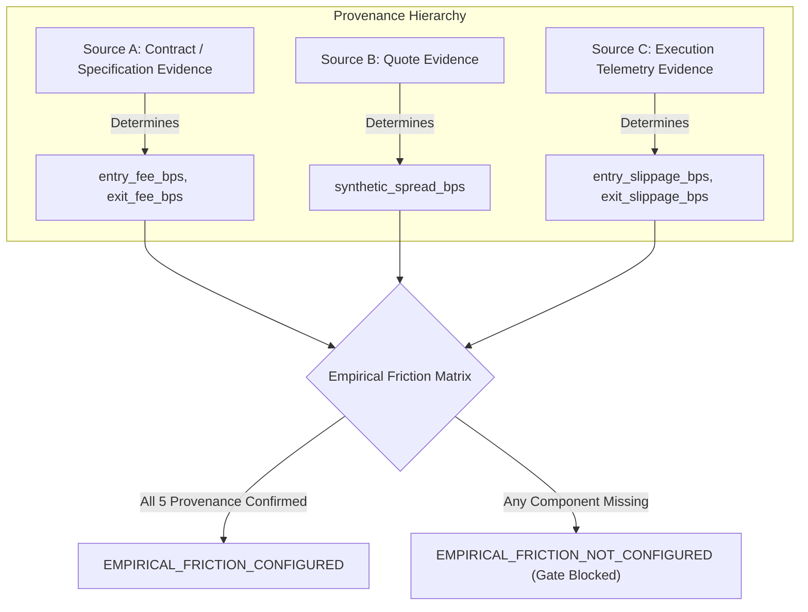

# AurumIQ — XAUUSD Empirical Friction Evidence & Cost Provenance

> **Governance Authority:** Post Phase 7 / Pre Phase 8 Calibration Campaign Protocol  
> **Status:** `EMPIRICAL_FRICTION_NOT_CONFIGURED`  
> **Target Instrument:** `XAUUSD` (Canonical Spot Gold denominated in USD)  
> **Backtest Scenario:** `XauUsdCostScenario.EMPIRICAL` (Blocked pending provenance)  
> **Authoritative Baseline Main SHA:** `57f6de1405d0df8548182a166d245f1a3173363d`  
> **Working Branch:** `research/xauusd-data-readiness`

---

## 1. Governance Mandate

In quantitative backtesting and empirical policy evaluation for spot gold (`XAUUSD`), transaction frictions exert an overwhelming influence on real expectancy. Under Phase 5/6 governance rules (Spec §33, §34, R17–R20):

1. **No Guesswork / No Synthetic Approximations as Empirical:** Values for transaction fees, spreads, and slippage cannot be arbitrarily assumed or guessed.
2. **Strict Provenance Separation:** Every basis-point parameter must trace directly to one of three authoritative empirical evidence categories.
3. **Fail-Closed Blocking:** Until all five required empirical cost components have documented, defensible provenance, backtests under `XauUsdCostScenario.EMPIRICAL` remain strictly **BLOCKED** and execution policy evaluation cannot be claimed as validated.

---

## 2. Required Empirical Friction Components

The platform mandates empirical calibration across five discrete friction parameters:

```
Total Roundtrip Friction = entry_fee_bps + exit_fee_bps + synthetic_spread_bps + entry_slippage_bps + exit_slippage_bps
```

| Parameter Name | Target Unit | Current Status | Description |
| :--- | :---: | :---: | :--- |
| **`entry_fee_bps`** | Basis Points ($0.0001$) | `NOT_CONFIGURED` | Effective broker/exchange commission on trade entry. |
| **`exit_fee_bps`** | Basis Points ($0.0001$) | `NOT_CONFIGURED` | Effective broker/exchange commission on trade liquidation. |
| **`synthetic_spread_bps`** | Basis Points ($0.0001$) | `NOT_CONFIGURED` | Expected half/full bid-ask spread cost for closed-candle simulation. |
| **`entry_slippage_bps`** | Basis Points ($0.0001$) | `NOT_CONFIGURED` | Adverse price displacement between signal generation and entry fill. |
| **`exit_slippage_bps`** | Basis Points ($0.0001$) | `NOT_CONFIGURED` | Adverse price displacement during stop-loss or take-profit execution. |

---

## 3. Provenance Hierarchy & Evidence Classification

To transition any friction parameter from `NOT_CONFIGURED` to `CONFIGURED`, evidence must be sourced from one of three distinct channels:



### Source A: Contract / Specification Evidence (Commissions & Clearing Fees)
- **Applicability:** Governs `entry_fee_bps` and `exit_fee_bps`.
- **Evidence Source:** Formal broker schedule, institutional ECN rate card, or prime brokerage clearing contract.
- **Conversion Formulation:**
  $$\text{Fee (bps)} = \left( \frac{\text{Commission Per Ounce / Lot}}{\text{Spot Reference Price}} \right) \times 10{,}000$$
- **Audit Requirement:** The signed fee schedule or institutional tier specification must be archived alongside the calibration artifact.

### Source B: Quote Evidence (Historical Bid/Ask Spreads)
- **Applicability:** Governs `synthetic_spread_bps`.
- **Evidence Source:** Authoritative point-in-time bid/ask quote series covering all trading sessions (London, New York, Asian, and session transitions).
- **Conversion Formulation:**
  $$\text{Spread (bps)} = \left( \frac{\text{Ask} - \text{Bid}}{\text{Mid Price}} \right) \times 10{,}000$$
- **Audit Requirement:** Spread distributions must be segmented by session and volatility regime. Static spread assumptions must represent at least the 75th percentile of observed liquid spreads.

### Source C: Execution Telemetry Evidence (Empirical Fill Slippage)
- **Applicability:** Governs `entry_slippage_bps` and `exit_slippage_bps`.
- **Evidence Source:** Execution timestamps and executed prices recorded during live paper observation, test orders, or institutional fix logs.
- **Conversion Formulation:**
  $$\text{Slippage (bps)} = \left( \frac{|\text{Executed Price} - \text{Decision Price}|}{\text{Decision Price}} \right) \times 10{,}000$$
- **Audit Requirement:** Must reflect actual latency (order transmission + matching queue) and adverse selection around liquidity sweeps.

---

## 4. Current Friction Provenance Audit Table

| Component | Provenance Category | Documented Source Reference | Observed Value | Gate Status |
| :--- | :--- | :--- | :---: | :---: |
| **`entry_fee_bps`** | Source A (Contract) | None (Awaiting broker onboarding) | `None` | ❌ `NOT_CONFIGURED` |
| **`exit_fee_bps`** | Source A (Contract) | None (Awaiting broker onboarding) | `None` | ❌ `NOT_CONFIGURED` |
| **`synthetic_spread_bps`** | Source B (Quotes) | None (Quote evidence count = 0) | `None` | ❌ `NOT_CONFIGURED` |
| **`entry_slippage_bps`** | Source C (Telemetry) | None (Phase 8 on HOLD; zero live fills) | `None` | ❌ `NOT_CONFIGURED` |
| **`exit_slippage_bps`** | Source C (Telemetry) | None (Phase 8 on HOLD; zero live fills) | `None` | ❌ `NOT_CONFIGURED` |

**Overall State:** **`EMPIRICAL_FRICTION_NOT_CONFIGURED`**

---

## 5. Execution Policy Governance Matrix

The platform supports multiple execution policies under research evaluation. Each policy has specific empirical friction prerequisites:

| Execution Policy | Required Evidence | Permissible Status Without Evidence | Notes |
| :--- | :--- | :--- | :--- |
| **`MARKET_AFTER_SIGNAL`** | Historical Bid/Ask Quotes (Source B) + Slippage Telemetry (Source C) | **`STRICTLY_BLOCKED`** | Requires real quotes at decision time; cannot be calibrated from OHLC alone. |
| **`NEXT_BAR_OPEN`** | Closed Candle Data + Validated Synthetic Spread/Slippage (Sources A, B, C) | **`RESEARCH_ONLY_WITH_IDEALIZED`** | May be tested with idealized zero-cost or explicit synthetic sensitivity grids. |
| **`LIMIT_ZONE`** | 1m/5m Intrabar Candlestick Replay (Phase 5 Causal Engine) | **`RESEARCH_ONLY_WITH_IDEALIZED`** | Evaluates passive limit fills; requires queue latency assumption and fee model. |

> [!IMPORTANT]
> `LIMIT_ZONE` is **not** declared the single defensible policy. All three execution policies remain under research governance. Their empirical viability will be determined comparatively once authentic evidence is ingested.

---

## 6. Sign-Off & Unblocking Criteria

To achieve `EMPIRICAL_FRICTION_CONFIGURED` and permit empirical walk-forward calibration:
1. Broker contract fee schedules must be archived in `docs/calibration/evidence/broker_rate_card.pdf`.
2. Historical quote spread analysis must be published in `docs/calibration/evidence/xauusd_spread_distribution.json`.
3. Fill slippage observation telemetry must be compiled from Phase 8 paper trading or certified broker execution reports.
4. Human review and explicit governance sign-off must authorize the configured parameter values.
